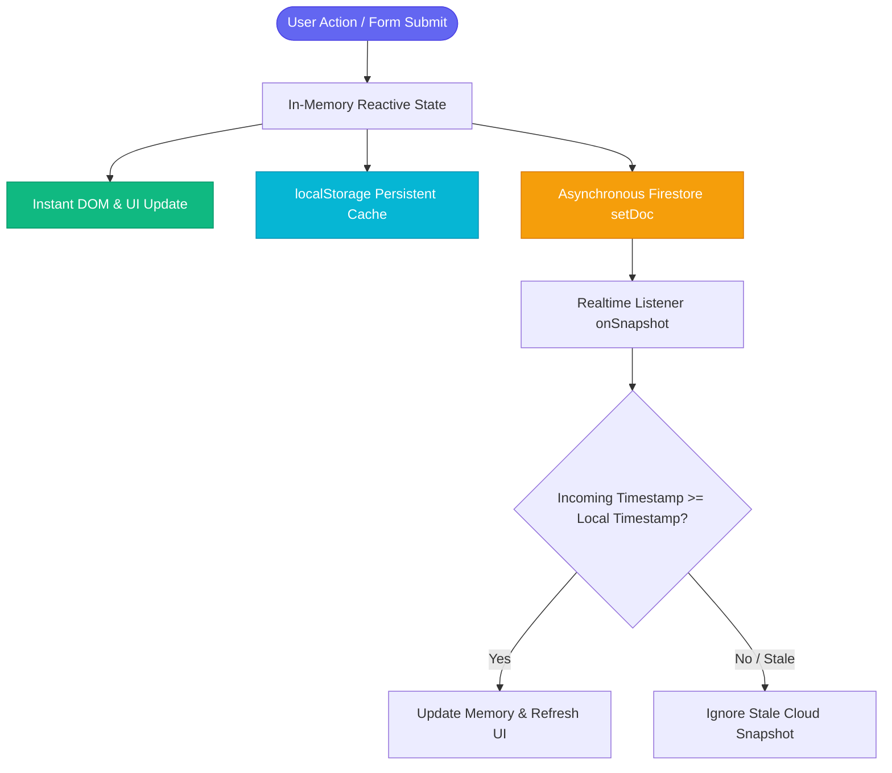
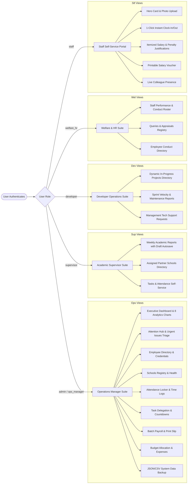
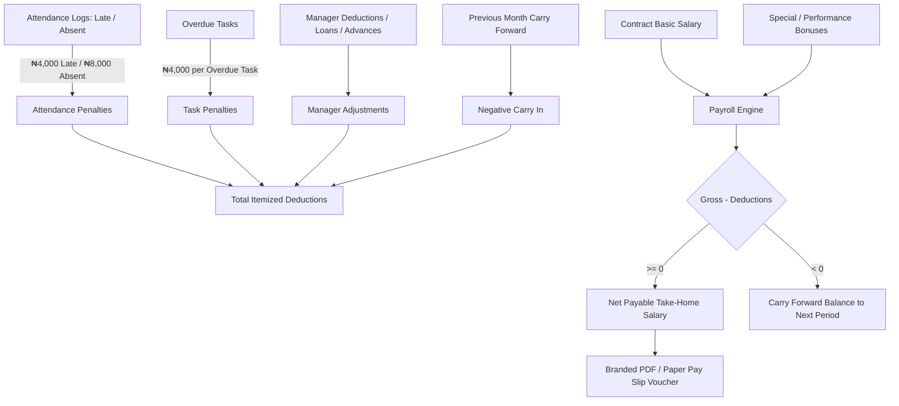
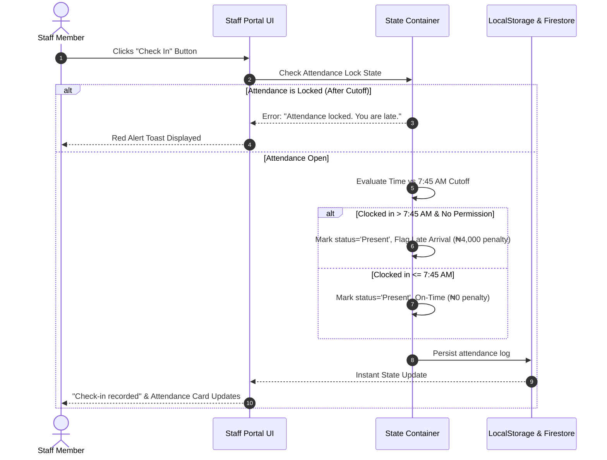

# 🏢 HLTS HR & Operations Management Suite

An enterprise-grade, local-first Human Resources and Multi-Department Operations Management platform engineered for educational technology companies, schools management networks, and distributed enterprise teams.

---

## 📑 Table of Contents
1. [System Overview](#-system-overview)
2. [Workflow & Architecture Diagrams](#-workflow--architecture-diagrams)
   - [1. Data Flow & Local-First Architecture](#1-data-flow--local-first-architecture)
   - [2. Role-Based Access Control & Navigation Matrix](#2-role-based-access-control--navigation-matrix)
   - [3. Payroll, Penalty & Voucher Computation Engine](#3-payroll-penalty--voucher-computation-engine)
   - [4. Staff Daily Clock-In & Attendance Lifecycle](#4-staff-daily-clock-in--attendance-lifecycle)
3. [Core Feature Breakdown by Department / Role](#-core-feature-breakdown-by-department--role)
   - [👑 Operations Manager / Executive Command](#-operations-manager--executive-command)
   - [🎓 Academic Supervisor](#-academic-supervisor)
   - [💻 Lead Developer / Technology Department](#-lead-developer--technology-department)
   - [🩺 Welfare & HR Specialist](#-welfare--hr-specialist)
   - [👤 Teaching & General Staff Portal](#-teaching--general-staff-portal)
4. [Storage Engine & Firebase Cloud Sync](#-storage-engine--firebase-cloud-sync)
5. [Data Export & Backup Engine](#-data-export--backup-engine)
6. [Initial Accounts & Authentication](#-initial-accounts--authentication)
7. [Project Directory & Modular Architecture](#-project-directory--modular-architecture)
8. [Installation & Local Deployment](#-installation--local-deployment)

---

## 🌟 System Overview

The **HLTS HR & Operations Management Suite** brings executive visibility, inter-departmental accountability, transparent staff remuneration, and real-time operations telemetry into a unified, responsive single-page web application.

- **Offline-First & Cloud-Synced**: Operates instantly with zero lag via synchronized `localStorage` caching and background Firestore synchronization.
- **Role-Gated Security**: 5 specialized role perspectives ensuring staff and managers see only what they need.
- **Automated Payroll Reconciliation**: Automatically computes late arrival fines, absence penalties, overdue task deductions, and manager adjustments.
- **Glassmorphism & 3D Interactive UI**: Ultra-clean dark theme with 3D tilt effects, responsive navigation drawer, and Chart.js analytics.

---

## 📊 Workflow & Architecture Diagrams

### 1. Data Flow & Local-First Architecture



---

### 2. Role-Based Access Control & Navigation Matrix



---

### 3. Payroll, Penalty & Voucher Computation Engine



---

### 4. Staff Daily Clock-In & Attendance Lifecycle



---

## 🚀 Core Feature Breakdown by Department / Role

### 👑 Operations Manager / Executive Command
- **Executive KPI Analytics**:
  - Live Staff Present Ratio, Urgent Issues Badge, Average Syllabus Pace, and Active Projects metric.
  - **8 Real-time Charts (Chart.js)**: Attendance Ratio, Curriculum Syllabus Progress, Teacher Lesson Note Compliance, Assessment & CBT Status, Client Satisfaction Index, Result Management Progress, Developer Velocity, and Welfare Staff Rating.
- **Attention Hub**: Immediate triage and response workflow for urgent departmental escalations.
- **Employee Directory**:
  - Profile photo uploads with client-side canvas compression (~15-25KB JPEG).
  - One-click account activation/deactivation.
  - Automated password and credential generation.
- **Attendance Management**: Daily logs filterable by date, search debounced at 150ms, with global Attendance Lock toggle.
- **Batch Payroll & Payouts**:
  - Single-click **"Batch Mark All Paid"** disbursement.
  - Granular adjustments (Loans, Advances, Disciplinary Deductions, Bonuses).
- **Budget Control**: Salary vs Operations spending limits with real-time overage alerts.

---

### 🎓 Academic Supervisor
- **Multi-School Academic Reporting**:
  - Weekly report submission logging Syllabus Pace, Lesson Note Compliance, CBT exams, Result Compilation, and Lab Status.
  - **Auto-Escalation**: Flagging an issue as *"Urgent Attention"* automatically routes it to the Operations Manager's Attention Hub.
- **Draft Autosave & Restore**: Unsubmitted report notes automatically cache per school in `localStorage` and restore when switching schools.
- **Schools Directory**: Partner schools registry with assigned supervisor mapping and institutional health status indicators.

---

### 💻 Lead Developer / Technology Department
- **Sprint & Velocity Reports**:
  - Dynamic Project Builder for in-house web apps and client school portals.
  - Maintenance tracking (Server, Bug Fixes, Feature Releases, Database optimization).
  - Management tech support requests with automatic routing to the Operations Manager.
- **Active Projects Directory**: Real-time project completion bars and blocker status.

---

### 🩺 Welfare & HR Specialist
- **Staff Performance & Conduct Rostering**: Weekly evaluation of active staff performance percentage, conduct assessments, and qualitative notes.
- **Queries & Appraisals Registry**: Issue formal Disciplinary Queries or Performance Appraisals with resolution toggle.

---

### 👤 Teaching & General Staff Portal
- **Hero Header**: Profile avatar with camera photo uploader, employee ID, role badge, and office department metadata.
- **Instant 1-Click Clock-In / Clock-Out**: Records presence and timestamps immediately.
- **Personal Financial Ledger**:
  - Live breakdown of Gross Contract Salary, itemized penalty justifications, and Net Payable Balance.
- **Printable Salary Pay Slip & Voucher**:
  - Dedicated branded modal with print styles (`@media print`) for clean paper salary slips.
- **Live Colleague Presence**: Real-time visibility into which colleagues are present today.
- **Task Timers**: Active countdown badges for assigned deliverables with visual overdue indicators.

---

## 🗄️ Storage Engine & Firebase Cloud Sync

The platform uses an **Offline-First / Local-First Storage Pattern**:
1. **Immediate Local Persistence**: On every create, edit, or delete action, state is synchronously committed to `localStorage`.
2. **Background Cloud Push**: Modified state is sent to Google Firebase Firestore (`doc(firebaseDb, 'appState', 'main')`) via `setDoc`.
3. **Monotonic Conflict Resolution**: Each write increments a `lastWriteTimestamp`. Incoming remote snapshots from `onSnapshot` older than local timestamps are safely discarded, preventing data reversion.
4. **Clean Seed Invalidation**: Any legacy demo caches are automatically refreshed to a pristine state on startup.

---

## 💾 Data Export & Backup Engine

The platform includes a zero-dependency client-side backup engine located in the Executive Dashboard:

| Export Type | Format | Contents |
| :--- | :---: | :--- |
| **Full System Backup** | `.JSON` | Complete database snapshot for offline restoration or migration. |
| **Payroll Ledger** | `.CSV` | Comprehensive payroll statement with gross pay, deductions, bonuses, and net take-home salary. |
| **Attendance Audit Log** | `.CSV` | Full log of clock-in/out timestamps, lateness status, and computed fines. |
| **Supervisor Reports** | `.CSV` | Academic syllabus tracking, examination metrics, and school feedback logs. |

---

## 🔑 Initial Accounts & Authentication

When the application boots with clean seed data, the following administrative office credentials are pre-configured:

| Role / Department | Login Email | Default Password |
| :--- | :--- | :--- |
| **Operations Manager (Admin)** | `admin@hr.local` | `Chrisella1!` |
| **Academic Supervisor** | `supervisor@hlts.local` | `Chrisella1!` |
| **Lead Developer** | `developer@hlts.local` | `Chrisella1!` |
| **Welfare & HR Specialist** | `welfare.hr@hlts.local` | `Chrisella1!` |

> [!NOTE]
> When adding new staff members in the **Employee Management Form**, staff login accounts are automatically provisioned with their Email as Username and Employee ID as default Password.

---

## 📁 Project Directory & Modular Architecture

```
hr/
├── public/
│   ├── index.html               # Main Single-Page Application DOM Shell
│   ├── styles.css               # Design System, Responsive Breakpoints & 3D Tilt
│   ├── app.js                   # Main Orchestrator & Event Dispatcher
│   ├── logo.jpg                 # Corporate Organization Branding
│   └── js/
│       ├── config.js            # Firebase credentials & Time Constants
│       ├── state.js             # Reactive State Container & Calculations
│       ├── utils.js             # Formatting, Compression, Avatars & Modals
│       ├── services/
│       │   ├── firestore.js     # Firestore Persistence & Real-time Listeners
│       │   └── export.js        # CSV & JSON Data Export Engines
│       └── modules/
│           ├── dom.js           # Centralized DOM Cache Registry
│           ├── auth.js          # Authentication & Role Perspective Switcher
│           ├── dashboard.js     # Executive Metrics & 8 Chart.js Instances
│           ├── managementIssues.js # Attention Hub & Escalation Triage
│           ├── supervisors.js   # Weekly Academic Reports & Draft Autosave
│           ├── developers.js    # Developer Sprints & Dynamic Project Builder
│           ├── welfare.js       # Staff Rostering & Appraisals/Queries
│           ├── schools.js       # Partner Schools Directory
│           ├── employees.js     # Employee Directory & Photo Uploads
│           ├── attendance.js    # Clock-In / Clock-Out & Attendance Locker
│           ├── tasks.js         # Deliverables Delegation & Countdowns
│           ├── payroll.js       # Payroll Ledger, Batch Payout & Print Slips
│           ├── finance.js       # Income & Operating Expense Entries
│           ├── budget.js        # Budget Limits & Spending Meters
│           └── staffPortal.js   # Staff Self-Service Experience
└── README.md                    # System Documentation & Architectural Guide
```

---

## ⚙️ Installation & Local Deployment

### Prerequisites
- Modern Web Browser (Google Chrome, Firefox, Microsoft Edge, Safari).
- Python 3.x or Node.js (for serving static files).

### 1. Running Locally
Start a local static server inside the `public/` directory:

```bash
# Using Python
python -m http.server 8080 --directory public

# Or using Node.js http-server
npx http-server public -p 8080
```

### 2. Accessing the Web Application
Open your web browser and navigate to:
```
http://localhost:8080
```

---
*Developed for HLTS Limited • Operations & Human Resources Management Suite*